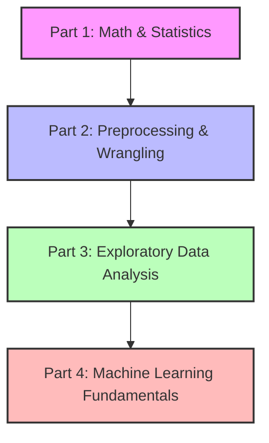

# 🚀 Python Data Science Roadmap & Guide

[](https://www.python.org/)
[](#prerequisites)
[](LICENSE)
[](#)

Selamat datang di repositori **Python Data Science Roadmap & Guide** oleh **aditzeb**! Repositori ini telah di-upgrade secara menyeluruh menjadi panduan lengkap dan terstruktur bagi siapa saja yang ingin mempelajari Data Science dari dasar menggunakan Python.

Tiap bab dalam repositori ini dilengkapi dengan **Panduan Teori (Markdown)** yang menjelaskan konsep secara intuitif dan **Jupyter Notebook Interaktif (Code)** berisi praktik langsung dengan data.

---

## 🗺️ Peta Jalan Belajar (Roadmap)



---

## 📂 Struktur Repositori & Navigasi

Berikut adalah direktori dan file panduan yang tersedia:

| Bagian | Topik Utama | 📝 Panduan Teori | 📓 Notebook Praktik |
| :--- | :--- | :---: | :---: |
| **01. Matematika & Statistika** | Mean, Median, Deviasi Standar, Varians, Distribusi, & Uji Hipotesis (t-Test) | [Teori](guides/01_mathematics_and_statistics.md) | [Notebook](notebooks/01_descriptive_and_inferential_statistics.ipynb) |
| **02. Data Preprocessing** | Data Cleaning, Imputasi Missing Values, Outliers, Feature Scaling, & Encoding | [Teori](guides/02_data_preprocessing_and_wrangling.md) | [Notebook](notebooks/02_data_preprocessing_and_wrangling.ipynb) |
| **03. Exploratory Data Analysis** | Univariate, Bivariate, & Multivariate Analysis dengan Matplotlib dan Seaborn | [Teori](guides/03_exploratory_data_analysis.md) | [Notebook](notebooks/03_exploratory_data_analysis.ipynb) |
| **04. Machine Learning** | Regresi Linear, Random Forest Klasifikasi, K-Means Clustering, & Tuning GridSearchCV | [Teori](guides/04_machine_learning_fundamentals.md) | [Notebook](notebooks/04_machine_learning_fundamentals.ipynb) |

---

## 🛠️ Cara Mulai Menggunakan Secara Lokal

Ikuti langkah-langkah berikut untuk menjalankan panduan dan notebook ini di komputer Anda:

### 1. Klon Repositori
```bash
git clone https://github.com/aditzeb/Data-Science.git
cd Data-Science
```

### 2. Setup Virtual Environment (Opsional, Direkomendasikan)
Untuk Windows:
```bash
python -m venv .venv
.venv\Scripts\activate
```
Untuk macOS/Linux:
```bash
python3 -m venv .venv
source .venv/bin/activate
```

### 3. Install Dependencies
Install seluruh library data science yang dibutuhkan menggunakan file `requirements.txt`:
```bash
pip install -r requirements.txt
```

### 4. Jalankan Jupyter Notebook
Jalankan server Jupyter Notebook untuk membuka file di folder `notebooks/`:
```bash
jupyter notebook
```
Atau jika Anda menggunakan **VS Code**, Anda bisa membuka folder repositori langsung dan menjalankan sel di dalam file `.ipynb` menggunakan ekstensi Python & Jupyter.

---

## ☁️ Menjalankan di Google Colab
Jika Anda tidak ingin menginstal Python di komputer lokal, Anda dapat mengunggah file notebook (`.ipynb`) dari folder `notebooks/` langsung ke [Google Colab](https://colab.research.google.com/) secara gratis.

---

## 📄 Lisensi
Proyek ini dilisensikan di bawah **MIT License** - lihat file [LICENSE](LICENSE) untuk detail lebih lanjut.
