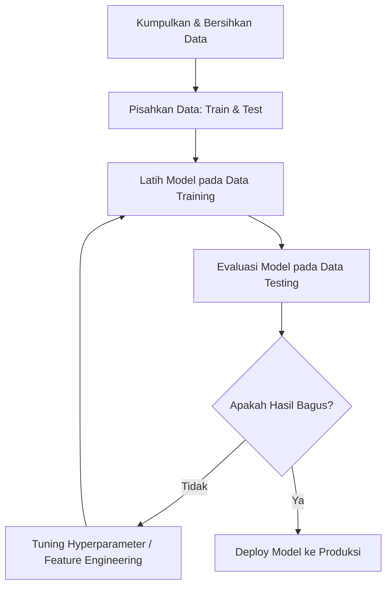

# Bagian 4: Machine Learning Fundamentals (Scikit-Learn)

Machine Learning (ML) adalah cabang dari kecerdasan buatan (AI) yang berfokus pada pembangunan sistem yang dapat belajar dari data, mengidentifikasi pola, dan membuat keputusan dengan intervensi manusia yang minimal. Library standard industri untuk ini di Python adalah **Scikit-Learn**.

---

## 1. Alur Kerja Pemodelan Machine Learning

Setiap proyek machine learning mengikuti siklus hidup berikut:


---

## 2. Klasifikasi Paradigma Machine Learning

### A. Supervised Learning (Pembelajaran Terawasi)
Data training memiliki label target (jawaban benar).
1. **Regresi (Regression):** Target berbentuk nilai kontinu/numerik (contoh: prediksi harga rumah, suhu).
   - *Algoritma:* Linear Regression, Ridge, Lasso, Decision Tree Regressor, Random Forest Regressor.
2. **Klasifikasi (Classification):** Target berbentuk kategori/label diskrit (contoh: Spam vs Bukan Spam, deteksi penyakit).
   - *Algoritma:* Logistic Regression, Decision Tree Classifier, Random Forest Classifier, Support Vector Machine (SVM), K-Nearest Neighbors (KNN).

### B. Unsupervised Learning (Pembelajaran Tanpa Pengawasan)
Data training tidak memiliki label. Sistem mencoba menemukan struktur tersembunyi sendiri.
1. **Clustering (Pengelompokan):** Mengelompokkan titik data yang mirip ke dalam cluster yang sama.
   - *Algoritma:* K-Means, Hierarchical Clustering, DBSCAN.
2. **Dimensionality Reduction:** Mengurangi jumlah fitur kolom sambil mempertahankan informasi penting.
   - *Algoritma:* PCA (Principal Component Analysis), t-SNE.

---

## 3. Validasi & Evaluasi Model

### A. Pembagian Data (Train/Test Split)
Data dibagi menjadi dua bagian:
- **Training Set (biasanya 70-80%):** Digunakan untuk melatih model mengenali pola.
- **Testing Set (biasanya 20-30%):** Digunakan untuk menguji performa model pada data baru yang belum pernah dilihat sebelumnya.

### B. Metrik Evaluasi Regresi
Mengukur seberapa jauh tebakan model dari nilai asli:
- **Mean Absolute Error (MAE):** Rata-rata selisih absolut antara prediksi dan nilai asli.
- **Mean Squared Error (MSE):** Rata-rata selisih kuadrat. Memberikan penalti lebih berat untuk error yang besar.
- **Root Mean Squared Error (RMSE):** Akar dari MSE, mengembalikan satuan ke nilai asli.
- **R-squared ($R^2$):** Persentase variabilitas target yang dapat dijelaskan oleh model (rentang 0-1). Semakin mendekati 1, semakin baik.

### C. Metrik Evaluasi Klasifikasi
Mengukur kualitas klasifikasi kategori:

| | Prediksi Positif | Prediksi Negatif |
| :--- | :--- | :--- |
| **Aktual Positif** | True Positive (TP) | False Negative (FN) - *Error Tipe II* |
| **Aktual Negatif** | False Positive (FP) - *Error Tipe I* | True Negative (TN) |

- **Accuracy (Akurasi):** Proporsi tebakan benar secara keseluruhan.
  $$\text{Accuracy} = \frac{TP + TN}{TP + TN + FP + FN}$$
- **Precision (Presisi):** Seberapa akurat model saat memprediksi kelas positif. (Penting saat False Positive mahal, misal: filter spam).
  $$\text{Precision} = \frac{TP}{TP + FP}$$
- **Recall (Sensitivitas):** Seberapa banyak kelas positif aktual yang berhasil dideteksi model. (Penting saat False Negative fatal, misal: diagnosis penyakit).
  $$\text{Recall} = \frac{TP}{TP + FN}$$
- **F1-Score:** Rata-rata harmonik dari Precision dan Recall. Sangat baik digunakan pada dataset yang tidak seimbang (imbalanced data).
  $$\text{F1} = 2 \times \frac{\text{Precision} \times \text{Recall}}{\text{Precision} + \text{Recall}}$$

---

## 4. Hyperparameter Tuning

- **Parameter:** Nilai internal model yang dipelajari selama training (misalnya bobot/weight koefisien regresi).
- **Hyperparameter:** Parameter konfigurasi eksternal model yang ditentukan oleh data scientist sebelum training dimulai (misalnya kedalaman pohon `max_depth` di Random Forest, atau nilai `k` di KNN).
- **Tuning:** Menemukan kombinasi hyperparameter terbaik menggunakan:
  - **GridSearchCV:** Mencoba semua kombinasi parameter secara sistematis.
  - **RandomizedSearchCV:** Mencoba sampel acak dari kombinasi parameter (lebih cepat untuk ruang pencarian besar).

---

## 5. Contoh Pipeline Pemodelan dengan Scikit-Learn

```python
from sklearn.datasets import make_classification
from sklearn.model_selection import train_test_split
from sklearn.ensemble import RandomForestClassifier
from sklearn.metrics import classification_report, confusion_matrix

# 1. Generate Dataset Dummy Klasifikasi
X, y = make_classification(n_samples=1000, n_features=10, random_state=42)

# 2. Train-Test Split
X_train, X_test, y_train, y_test = train_test_split(X, y, test_size=0.2, random_state=42)

# 3. Inisialisasi Model & Fitting
model = RandomForestClassifier(n_estimators=100, max_depth=5, random_state=42)
model.fit(X_train, y_train)

# 4. Prediksi
y_pred = model.predict(X_test)

# 5. Evaluasi Performa
print("Confusion Matrix:")
print(confusion_matrix(y_test, y_pred))
print("\nClassification Report:")
print(classification_report(y_test, y_pred))
```

*Untuk melihat implementasi lengkap dari pemodelan regresi, klasifikasi, k-means clustering, hingga hyperparameter tuning pada dataset riil, buka notebook:*
👉 [04_machine_learning_fundamentals.ipynb](file:///c:/Users/Adit%20Victus/Desktop/Github/Data-Science/notebooks/04_machine_learning_fundamentals.ipynb)
